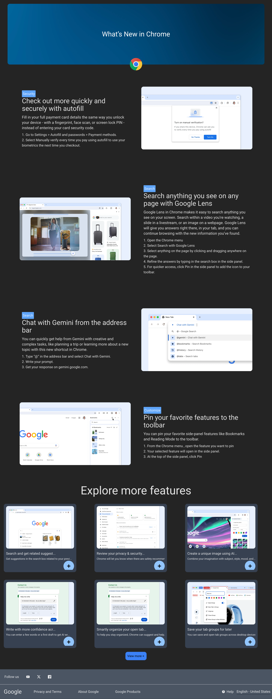
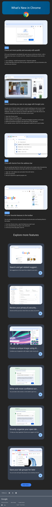

# Chrome "What's New" Page Clone

This is a responsive clone of Chrome's "What's New" page , created with **React.js** and **Tailwind CSS** This project is designed just like the Google Chrome page!

## Features

- Fully responsive layout for desktop and mobile devices.
- Inspired by Chrome's actual "What's New" page.
- Styled using Tailwind CSS for fast and efficient UI development.
- Built with reusable React components for better maintainability.

## Tech Stack

- **React.js**: For building UI components.
- **Tailwind CSS**: For styling and responsive design.
- **Vite**:This project was built with Vite.

## Screenshots

### Desktop View

### Mobile View

